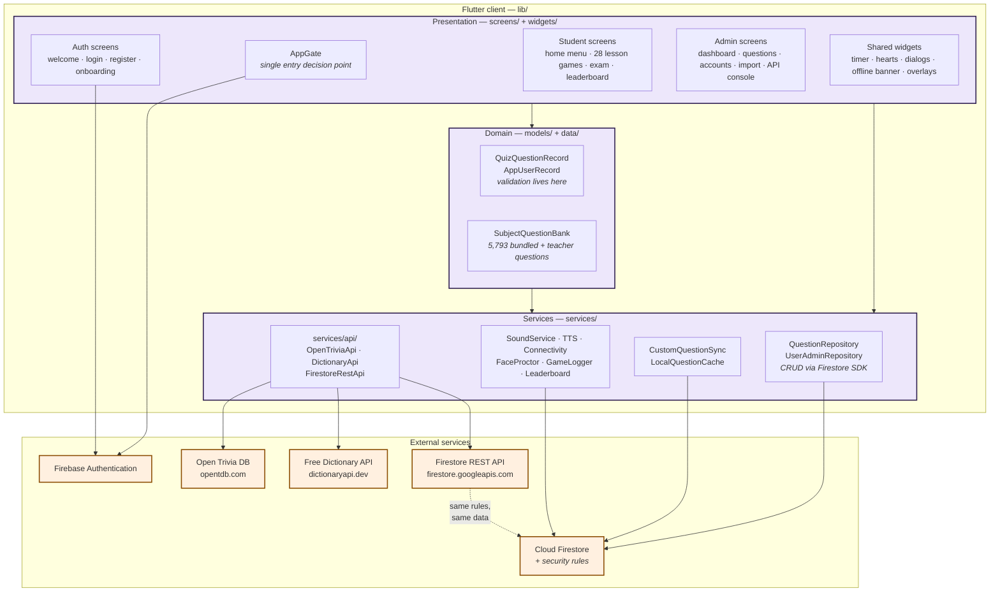
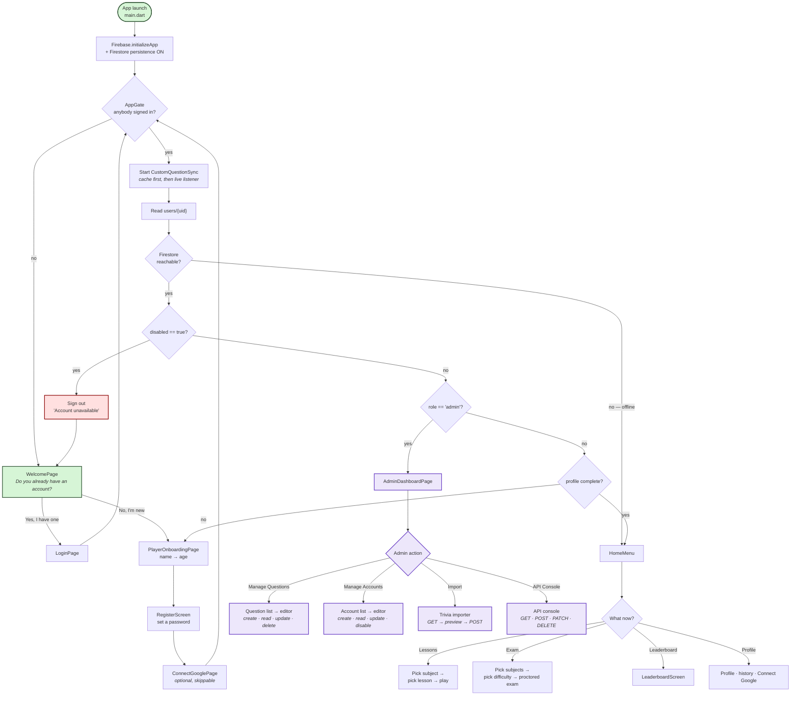
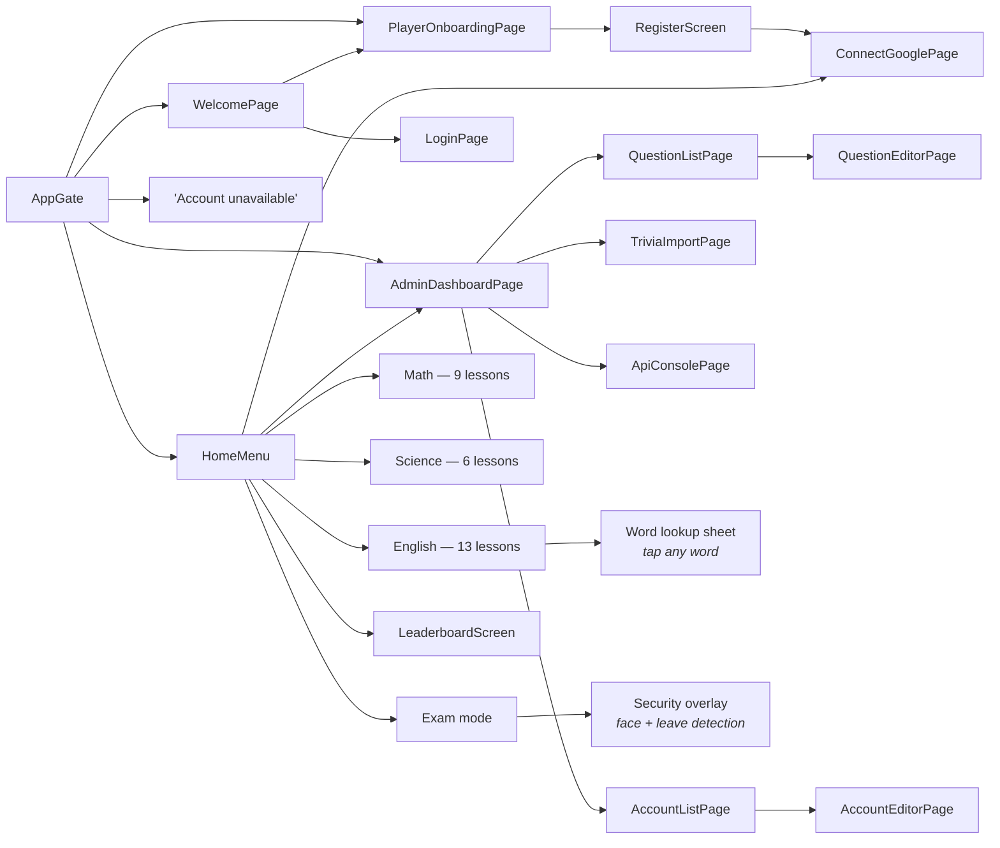
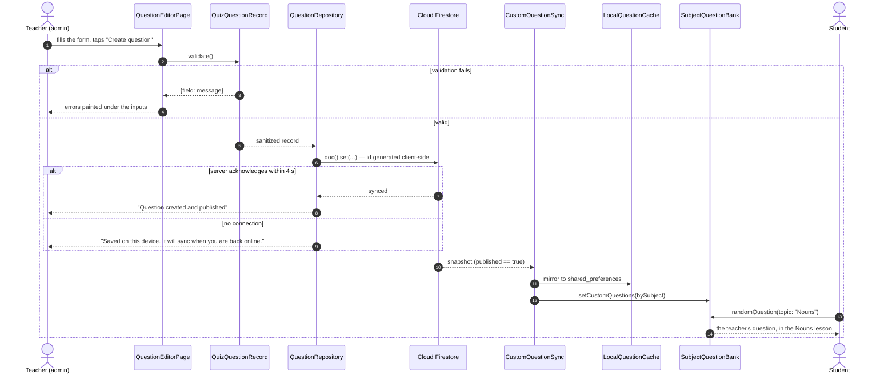
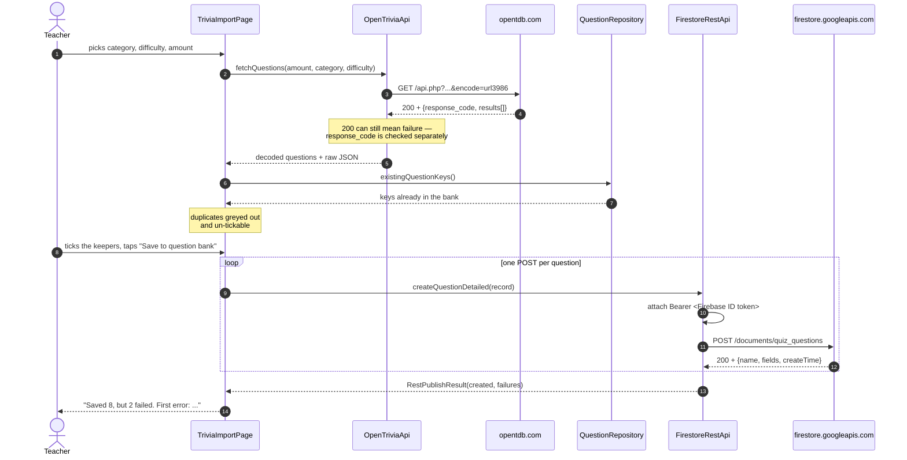
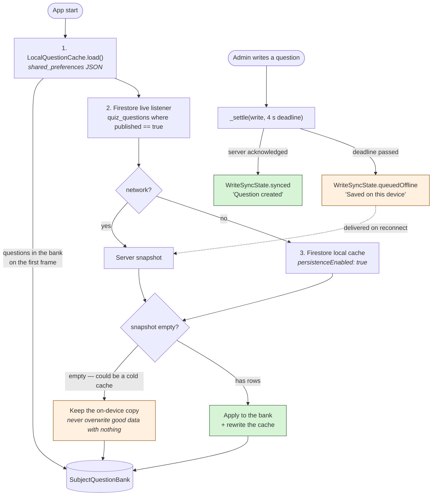
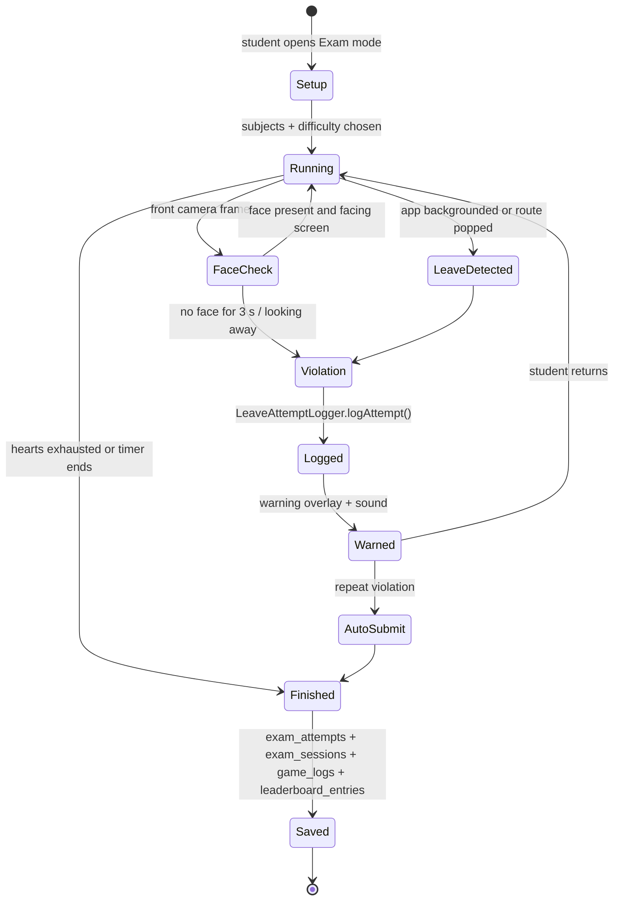

# Lock In — System Architecture & Flowcharts

Diagrams are written in Mermaid, which GitHub renders inline. To export one as
an image for a slide deck, paste the fenced block into https://mermaid.live.

---

## 1. System architecture (layered)



**Why it is shaped this way.** Validation lives on the models, so the editor
form, the bulk importer, and the repository all enforce identical rules — a bad
question cannot be persisted regardless of which screen calls in. The API layer
is isolated behind one exception type (`ApiException`), so the UI has a single
error shape to render. And the REST client writes to the same collection the SDK
repository does, carrying the caller's ID token, so REST-created and
SDK-created questions are indistinguishable to the rest of the app.

---

## 2. Application flowchart — start-up and routing

`AppGate` (`lib/app_gate.dart`) is the single decision point. Every sign-in and
sign-out routes back through it, which is why there is one login screen for
everybody: the gate reads the account's role after authentication and sends an
admin to the panel and a student to the games.



---

## 3. Navigation map

The app navigates imperatively with `Navigator.push` rather than named routes —
there is no route table to reproduce. This is the reachable screen graph.



| Route class | File |
|---|---|
| `AppGate` | [lib/app_gate.dart](../lib/app_gate.dart) |
| `WelcomePage` / `LoginPage` / `RegisterScreen` / `ConnectGooglePage` | [lib/screens/auth/](../lib/screens/auth/) |
| `PlayerOnboardingPage` | [lib/screens/onboarding/player_onboarding_page.dart](../lib/screens/onboarding/player_onboarding_page.dart) |
| `HomeMenu` | [lib/screens/home/home_menu.dart](../lib/screens/home/home_menu.dart) |
| Lesson games | [lib/screens/english/](../lib/screens/english/), [lib/screens/math/](../lib/screens/math/), [lib/screens/science/](../lib/screens/science/) |
| `ExamGame` | [lib/screens/exams/exam_game.dart](../lib/screens/exams/exam_game.dart) |
| `LeaderboardScreen` | [lib/screens/profile/leaderboard_screen.dart](../lib/screens/profile/leaderboard_screen.dart) |
| Admin screens | [lib/screens/admin/](../lib/screens/admin/) |

---

## 4. Data flow — a teacher's question reaching a student

This is the path that makes the Create operation visible rather than
theoretical.



**The key move** is step 12: `SubjectQuestionBank._poolFor(subject)`
concatenates the bundled `const` questions with the teacher pool, so
`randomQuestion(...)` draws from both. Because lessons filter by *topic*, a
question saved under an existing topic appears in that lesson immediately — no
app restart.

---

## 5. Data flow — API import (GET → preview → POST)



---

## 6. Offline strategy

Three independent layers, so no single failure takes the questions away.



**Why the 4-second deadline exists.** A Firestore write Future only completes
once the *server* acknowledges it. Offline that never happens, so a plain
`await` would leave the save button spinning forever even though the question is
already stored locally and queued. `QuestionRepository._settle` gives the
acknowledgement a deadline and otherwise reports `queuedOffline` — the write is
durable either way.

---

## 7. Exam proctoring flow



Every violation increments `cheat_attempts_count` on the user document and adds
a row to `users/{uid}/leave_attempts`, so a teacher can see the pattern rather
than a single number. Face frames are processed on-device by ML Kit and are
never uploaded.

---

## 8. Directory map

```
lib/
├── main.dart                     app entry, Firebase init, offline persistence
├── app_gate.dart                 the routing decision point (see §2)
├── auth_gate.dart, onboarding_gate.dart
├── data/
│   ├── subject_question_bank.dart      bundled + teacher question pools
│   └── questions/                      5,793 questions across 18 topic files
│       ├── english/  (12 files)
│       └── science/  (6 files)
├── models/                       QuizQuestionRecord, AppUserRecord (validation)
├── screens/                      45 files
│   ├── admin/    6 screens       dashboard, questions, accounts, import, console
│   ├── auth/     4 screens       welcome, login, register, connect Google
│   ├── english/ 13 games
│   ├── math/     9 games
│   ├── science/  6 games
│   ├── exams/    exam_game.dart
│   ├── home/     home_menu.dart
│   ├── onboarding/, profile/, shared/
├── services/                     23 files
│   ├── api/                      the whole HTTP surface (4 files)
│   ├── question_repository.dart  CRUD — quiz_questions
│   ├── user_admin_repository.dart CRUD — users
│   ├── custom_question_sync.dart, local_question_cache.dart
│   └── proctoring, sound, TTS, connectivity, logging, leaderboard
├── utils/                        theme, constants, firebase options, layout
└── widgets/                      21 reusable widgets
test/                             9 files, 136 tests
tool/                             CLI scripts — API smoke test, sample-data seeder
firestore.rules                   server-side role enforcement
```
