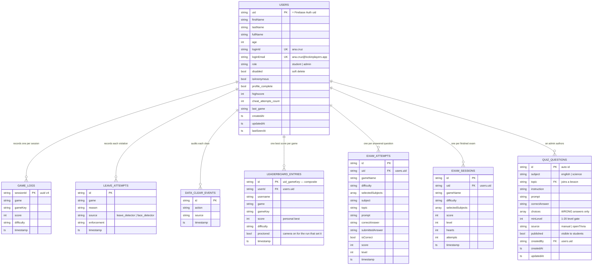
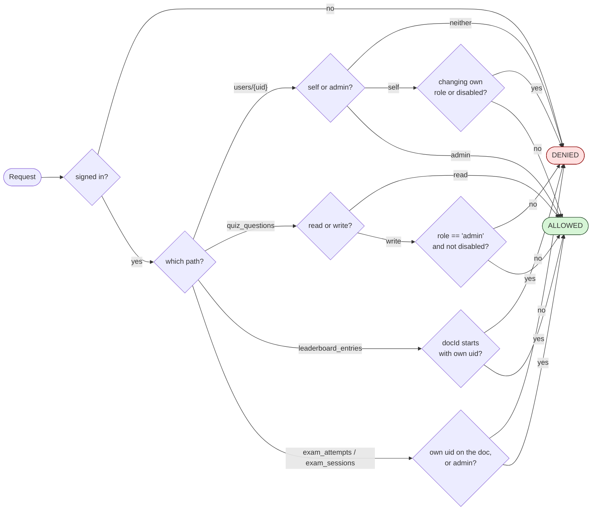

# Lock In — Database Design

**Engine:** Cloud Firestore (NoSQL, document/collection)
**Project:** `benchmark-14acf`
**Rules:** [`firestore.rules`](../firestore.rules), deployed with
`firebase deploy --only firestore:rules`

Firestore is schemaless at the engine level, so the "schema" below is the
contract the application code enforces — through the model classes
([`QuizQuestionRecord`](../lib/models/quiz_question_record.dart),
[`AppUserRecord`](../lib/models/app_user_record.dart)) and the security rules.

---

## 1. Entity–relationship diagram



### Relationship notes

Firestore has no foreign keys, so relationships are expressed two ways:

- **By nesting** — `game_logs`, `leave_attempts`, and `data_clear_events` are
  *subcollections* of `users/{uid}`. Ownership is structural: the document path
  itself carries the relationship, which is also what lets the security rules
  authorise them with a simple `isSelf(uid)` check.
- **By a `uid` field** — `exam_attempts`, `exam_sessions`, and
  `leaderboard_entries` are top-level so they can be queried across all
  students, and carry the owner's uid as a plain field. The rules verify it.

`leaderboard_entries` uses a **composite document id** — `{uid}_{gameKey}` —
which is what enforces "one row per player per game" without a transaction to
find the existing row. The rules use the same shape:
`entryId.split('_')[0] == request.auth.uid`.

---

## 2. Collection: `quiz_questions` — the main CRUD entity

This is the entity the system is built around: an admin writes the questions,
and students are asked them inside the existing lessons.

**Path:** `quiz_questions/{autoId}`
**Model:** [`QuizQuestionRecord`](../lib/models/quiz_question_record.dart)
**Repository:** [`QuestionRepository`](../lib/services/question_repository.dart)

| Field | Type | Required | Constraint | Notes |
|---|---|:--:|---|---|
| `subject` | string | ✔ | `english` \| `science` | Enum name of `SubjectQuizType`. Unknown values fall back to `english`. |
| `topic` | string | ✔ | 1–60 chars | **Joins the question to a lesson.** A question tagged `Nouns` appears in the Nouns and Pronouns lesson. |
| `instruction` | string | ✔ | non-empty | What the student is being asked to do, e.g. "Choose the noun". |
| `prompt` | string | ✔ | 5–600 chars | The question itself. |
| `correctAnswer` | string | ✔ | non-empty | Mixed back in and shuffled at play time. |
| `choices` | array&lt;string&gt; | ✔ | 2–5 items, distinct, case-insensitive, must not contain `correctAnswer` | **Wrong answers only** — see below. |
| `minLevel` | int | ✔ | 1–20 | Level gate. Imported questions map `easy→1`, `medium→4`, `hard→7`. |
| `source` | string | ✔ | `manual` \| `openTrivia` | Lets an admin tell their own authoring apart from an API pull; drives the "From API" dashboard stat. |
| `published` | bool | ✔ | default `true` | Only `published == true` reaches students. Toggled without deleting. |
| `createdBy` | string | — | `users.uid` | Audit stamp. Never rewritten by an update. |
| `createdAt` | timestamp | — | server | Set once on create. |
| `updatedAt` | timestamp | — | server | Rewritten on every update; drives the admin list sort. |
| `seedTag` | string | — | `sample-data` | Only present on rows written by `tool/seed_sample_data.dart`, so `--clean` can find exactly its own. |

### Why `choices` holds only the wrong answers

`choices` deliberately excludes the correct answer. The game engine mixes
`correctAnswer` back in and shuffles at play time
(`SubjectQuizQuestion.shuffled`), which is the same contract the 5,809 bundled
questions already use — so admin-written questions and bundled questions are
interchangeable and one code path plays both.

### Example document

```json
{
  "subject": "science",
  "topic": "Solar System",
  "instruction": "Choose the correct answer.",
  "prompt": "Which planet is the largest in our solar system?",
  "correctAnswer": "Jupiter",
  "choices": ["Mars", "Venus", "Earth"],
  "minLevel": 1,
  "source": "manual",
  "published": true,
  "createdBy": "kPq2xN8vTZbW1mA0",
  "createdAt": "2026-08-16T04:12:55.401Z",
  "updatedAt": "2026-08-16T04:12:55.401Z"
}
```

---

## 3. Collection: `users` — accounts

**Path:** `users/{uid}` — the document id **is** the Firebase Auth uid
**Model:** [`AppUserRecord`](../lib/models/app_user_record.dart)
**Repository:** [`UserAdminRepository`](../lib/services/user_admin_repository.dart)

### Identity and profile

| Field | Type | Constraint | Notes |
|---|---|---|---|
| `uid` | string | = document id | Duplicated into the body for convenience. |
| `firstName` | string | required, ≤40, letters only | Pattern `^[A-Za-zÀ-ÿ' .-]+$`. |
| `lastName` | string | required, ≤40, letters only | Same pattern. |
| `fullName` | string | derived | `firstName + ' ' + lastName`. |
| `username` | string | derived | Legacy alias for `fullName`; both are written so older documents keep resolving. |
| `age` | int | 4–100 | Required to finish onboarding. |
| `loginId` | string | derived, unique | `ana.cruz` — built by `buildNameLoginId`. |
| `loginEmail` / `email` | string | derived, unique | `ana.cruz@lockinplayers.app`. **The app has no email field in its UI** — a name and password are turned into a synthetic email so Firebase's email/password provider can be used with credentials a child can remember. |
| `authProvider` | string | `email` \| `anonymous` \| `google` | How this account signs in. |

### Access control

| Field | Type | Notes |
|---|---|---|
| `role` | string | `student` \| `admin`. Anything that is not exactly `admin` is a student, so documents written before this field existed stay students. |
| `disabled` | bool | **Soft delete.** `AppGate` and `LoginPage` both refuse entry. |
| `disabledAt` / `disabledBy` | timestamp / uid | Set when disabled, nulled when restored. |
| `isAnonymous` | bool | True for guest sessions that never registered. |

### Onboarding state

| Field | Type | Notes |
|---|---|---|
| `profile_complete` | bool | The gate requires this **plus** a real name and age before letting a player into the games. |
| `onboarding_step` | string | Where the player stopped, so onboarding resumes rather than restarts. |
| `profileCompletedAt` | timestamp | |
| `terms_accepted_at` | timestamp | |

### Progress and scores

| Field | Type | Notes |
|---|---|---|
| `highscore` | int | Best score across every game. |
| `{gameKey}_highscore` | int | Per-game best, one field per game — e.g. `analog_clock_highscore`, `fractions_highscore`, `easy_exam_highscore`. `gameKey` is the game name lower-cased with non-alphanumerics collapsed to `_`. |
| `last_game`, `last_game_key`, `last_score`, `last_played` | string / int / ts | Most recent session, shown on the profile card. |

### Proctoring counters

| Field | Type | Notes |
|---|---|---|
| `cheat_attempts_count` | int | Incremented on every violation of either kind. |
| `leave_attempts_count` / `last_leave_attempt_at` | int / ts | App-leave detector only. |
| `face_cheat_attempts_count` / `last_face_cheat_at` | int / ts | Face detector only. |
| `last_cheated_game`, `last_cheat_reason`, `last_cheat_source`, `last_cheat_attempt_at` | string / ts | Detail of the most recent violation. |
| `cheated_games` | array&lt;string&gt; | `arrayUnion` of every game where a violation happened. |

### Audit

| Field | Type | Notes |
|---|---|---|
| `createdAt` / `accountCreatedAt` | timestamp | Both written; `accountCreatedAt` is the older name. |
| `updatedAt` | timestamp | |
| `lastSeenAt` / `lastLoginAt` | timestamp | `lastSeenAt` is stamped by `AppGate` on every cold start. |
| `createdBy` | uid | Set when an admin creates the account for someone. |
| `history_cleared_at`, `last_data_clear_at`, `last_data_clear_source`, `data_clear_count` | ts / string / int | Written by the profile screen's "Clear data" button. |

---

## 4. Subcollections of `users/{uid}`

### `game_logs/{sessionId}`

One document per play session, keyed by a client-generated UUID v4 so repeated
score saves within a session update the same row instead of creating duplicates.

| Field | Type | Notes |
|---|---|---|
| `game` / `gameKey` | string | Display name and its normalised key. |
| `score` | int | |
| `difficulty` | string | Present only for games that have difficulty modes. |
| `sessionId` | string | Duplicated into the body. |
| `proctored` | bool | Whether the front camera was actually watching this run. **Absent** when the question does not apply - proctoring was switched off by an admin, or the platform never supports it - which is deliberately different from `false`, meaning "we tried to watch and could not". |
| `timestamp` / `updatedAt` | timestamp | Server-stamped. |

### `leave_attempts/{autoId}`

One document per proctoring violation.

| Field | Type | Notes |
|---|---|---|
| `game` | string | |
| `reason` | string | e.g. `noFaceDetected`, `notFacingDevice`, app backgrounded. |
| `source` | string | `leave_detector` \| `face_detector`. |
| `enforcement` | string | `auto_restart`. |
| `auto_submit_after_leaves` | int | Violations tolerated before the exam is auto-submitted. |
| `timestamp` | timestamp | |

### `data_clear_events/{autoId}`

Audit trail for the profile screen's "Clear data" action: `action`, `source`,
`timestamp`.

> **Fixed in this submission.** `firestore.rules` had no match block for this
> subcollection. Rules do not cascade, so the write was denied and the handler
> threw before the player saw any confirmation — the button appeared to do
> nothing. A block matching the `game_logs` pattern was added.

---

## 5. Top-level collections

### `leaderboard_entries/{uid}_{gameKey}`

One row per player per game, holding only their personal best.

| Field | Type | Notes |
|---|---|---|
| `userId` | string | The owner's uid; also the first half of the document id. |
| `username` / `fullName` | string | Denormalised so the leaderboard renders without a join. |
| `game` / `gameKey` | string | |
| `score` | int | Personal best. Written inside a transaction that reads the existing score first and only replaces it when the new one is higher. |
| `difficulty` | string | Optional. |
| `proctored` | bool | Optional. Whether the front camera was watching the run that set this score. Drives the "Camera on" / "Camera off" badge on the leaderboard row. |
| `timestamp` / `updatedAt` / `lastSeenAt` | timestamp | |

**Why `proctored` is only written with a new best score.** The row describes the
run that set the stored score, so the "score did not beat the stored one" branch
writes the name and `lastSeenAt` and nothing else. Rewriting the badge on a
weaker run would let a player turn the camera on, play badly once, and relabel an
unwatched high score as watched.

**Why a missing `proctored` shows no badge.** Every row written before the badge
existed has no such field, and so does any row a client wrote without one. The
leaderboard reads it defensively and renders nothing rather than labelling an
unknown run "Camera off".

**Why the name is denormalised. Firestore cannot join. Copying the display
name onto the entry means the leaderboard is one query instead of one query plus
N profile reads. A name change rewrites it on the next score save.

### `exam_attempts/{autoId}`

One document per **answered question** in an exam — the fine-grained record that
future analytics will read: `uid`, `gameName`, `difficulty`,
`selectedSubjects[]`, `subject`, `topic`, `prompt`, `correctAnswer`,
`submittedAnswer`, `isCorrect`, `score`, `level`, `proctored`, `timestamp`.

### `exam_sessions/{autoId}`

One document per **finished exam**: `uid`, `gameName`, `difficulty`,
`selectedSubjects[]`, `score`, `level`, `hearts`, `attempts`, `proctored`,
`timestamp`.

### `app_config/{docId}` — teacher-owned app settings

Currently one document, `proctoring`. Readable by any signed-in device,
writable only by an admin.

| Field | Type | Notes |
|---|---|---|
| `faceProctorExams` | bool | Watch during Exam mode. Defaults to `true`. |
| `faceProctorLessons` | bool | Watch during the practice games. Defaults to `true`. |
| `updatedAt` / `updatedBy` | timestamp / uid | Audit stamp. |

**Why this is server-side.** One teacher decision has to reach every device at
once, and no student may raise it. It is the outer gate on proctoring, not the
whole answer — see *The player's own switch* below.

**Why a missing field means `true`.** `ProctoringConfig.fromMap` falls back to
the default for anything absent or non-boolean, so a half-written document
cannot silently disable proctoring for a whole class. The document not existing
at all is also valid — it just means no admin has saved yet, and the defaults
apply. Each device also mirrors the last known values to
`shared_preferences`, so a cold offline launch still starts a game with the
right setting.

### The player's own switch — not stored in Firestore

The camera has a second switch, owned by the student, under **Camera anti-cheat**
in their profile settings. Both have to say yes before a lens opens:
`faceProctorEnabledFor(isExam:)` in `lib/services/player_proctoring_preference.dart`
is the single expression every game screen asks, so a teacher's `false` always
wins and a student can only decline within what is already allowed.

It is a plain `shared_preferences` bool, keyed `lockin.face_proctor_opt_in.v1.<uid>`
— per uid rather than per device, so two children sharing a tablet cannot inherit
each other's answer, and cleared at sign-out. It is deliberately **not** in
Firestore: a game screen reads it on its first frame, and a network round trip
there would mean either blocking the start of a round or guessing.

**Why letting a student opt out does not defeat the anti-cheat.** Declining is
not secret. The choice is recorded on the score (`proctored: false`) and shows as
a "Camera off" badge beside that player's name on the leaderboard, so an
unwatched high score is visibly unwatched. A teacher who wants no opt-out at all
turns the relevant switch off in Exam Security, which stops the camera and marks
every score the same way for everybody.

---

## 6. Security rules

Full source: [`firestore.rules`](../firestore.rules). The rules mirror the UI's
role check on the server, so the admin screens cannot be bypassed by talking to
Firestore directly — or by talking to the REST API, which is authenticated with
the same ID token.



| Collection | Read | Create | Update | Delete |
|---|---|---|---|---|
| `users/{uid}` | self or admin | admin, or self as a non-disabled **student** | admin, or self **without changing `role`/`disabled`** | **never** |
| `users/{uid}/game_logs` | self or admin | self | self | self |
| `app_config/{docId}` | any signed-in | admin | admin | admin |
| `users/{uid}/leave_attempts` | self or admin | self | self | self |
| `users/{uid}/data_clear_events` | self or admin | self | self | self |
| `quiz_questions` | any signed-in user | admin | admin | admin |
| `leaderboard_entries` | any signed-in user | owner (by document id) | owner | owner |
| `exam_attempts` | owner or admin | owner | admin | admin |
| `exam_sessions` | owner or admin | owner | owner or admin | admin |

### The two rules that matter most

**A student cannot promote themselves.** `keepsOwnPrivileges()` compares the
incoming `role` and `disabled` against the stored values and rejects a self-edit
that changes either. This is also why the *first* admin has to be promoted once
from the Firebase console — the rules would refuse to let the app do it.

**A disabled admin is not an admin.** `isAdmin()` requires
`disabled != true` as well as `role == 'admin'`, so deactivating an admin
revokes their write access immediately rather than at their next sign-in.

**Owning a top-level document means owning its `uid` field.** `exam_attempts`
and `exam_sessions` both sit outside `users/{uid}`, so nothing about the
document path proves who they belong to. Both therefore check the `uid` the
client wrote (`request.resource.data.uid == request.auth.uid` on create) and
the `uid` already stored (`ownsDoc()` on update). `exam_sessions` used to
accept a create or update from *any* signed-in account, which let one student
overwrite another's session record.

---

## 7. Indexes

**None required.** Every query filters on at most one equality field, and all
sorting is done client-side:

- `QuestionRepository.watchQuestions` — `where('subject', isEqualTo: ...)`, sorted in Dart
- `QuestionRepository.fetchPublished` — `where('published', isEqualTo: true)`
- `UserAdminRepository.watchAccounts` — no filter, sorted in Dart
- `UserAdminRepository.countActiveAdmins` — `where('role', isEqualTo: 'admin')`
- `LeaderboardScreen` — `orderBy('score', descending: true)`, single field

This is deliberate: the project deploys to a clean Firebase project with no
composite index setup. It is a classroom-scale trade-off, and §4 of
[PROJECT_DOCUMENTATION.md](PROJECT_DOCUMENTATION.md) records it as a limitation.

---

## 8. Data volume

| Store | Size |
|---|---|
| Bundled questions (compiled into the app) | **5,809** across 18 topic files — English 2,953, Science 2,856. 5,784 are distinct; 25 are written twice and are de-duplicated when the pool is built. |
| Math questions | Generated at run time, effectively unbounded |
| Teacher-authored questions | Unbounded, in `quiz_questions` |
| Accounts | One document per player, plus subcollections |

Bundled questions are `const` Dart literals, not database rows — they ship with
the app so a student can play with no account and no connection. Teacher
questions are pooled *with* them at run time by
[`SubjectQuestionBank`](../lib/data/subject_question_bank.dart), not instead of
them.
